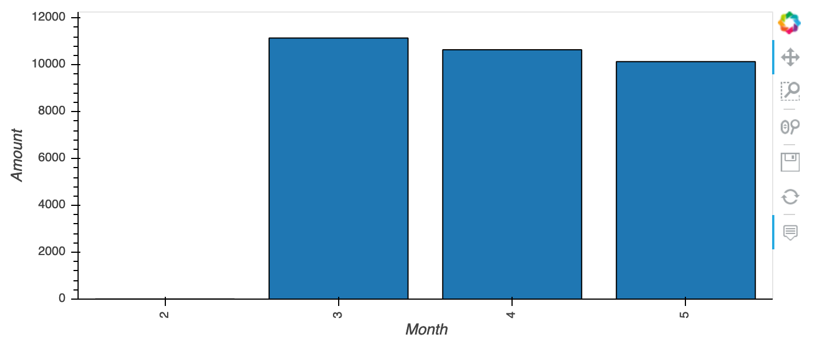
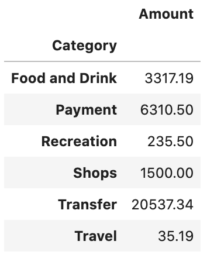
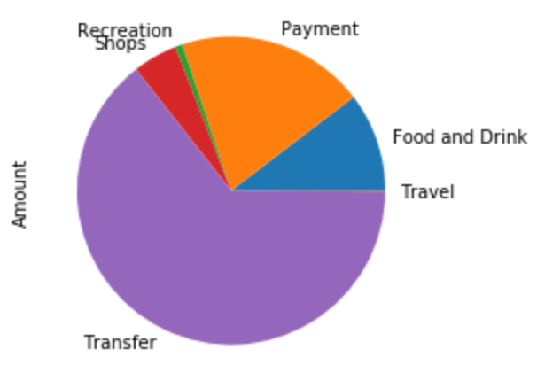
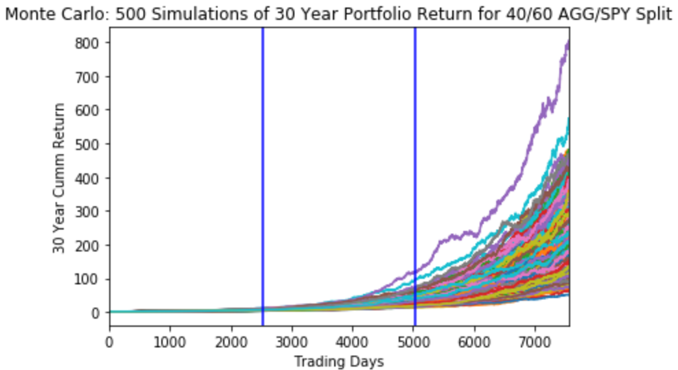

# Financial Planning Report: ins_109508
## Budget Analysis

Institution ins_109508 income stats are stated below:

* Employer: United Airlines
* Monthly Income: $500
* Last Year Income: $6,000
* Last Year Income before Tax: $7,285
* Projected Yearly Income: $6,085
* Projected Yearly Income before Tax: $7,389

Over the last 90 days, Institution ins_109508 expenses have exceeded their monthly income. For the month of Mar, Apr, and May, the expenses have exceeded the Yearly Income.

*Montlhy Expenses*

47 transactions occured within the last 90 days.  A summary of the expenses by category are detailed below:

*Spending Expenses*

*Spending Pie Chart*

## Retirement Planner
Assuming similar returns as in 2019 (Jan 1, 2019 to Dec 31, 2019), a porfolio made up of 40% AGG and 60% SPY would expect the following returns with an initial investment of $20,000 after 30 years of investing: 
* 10th Percentile: $2,380,597.16 
* 50th Percentile: $3,981,799.40 
* 90th Percentile: $6,410,996.62

The graph below shows the projected returns after 10, 20, and 30 years of investing.

Assuming a 10th percentile return and a 4% withdrawal, you will earn more income in retirement ($95,223k before tax) than you currently make today ($7,389 before tax).
