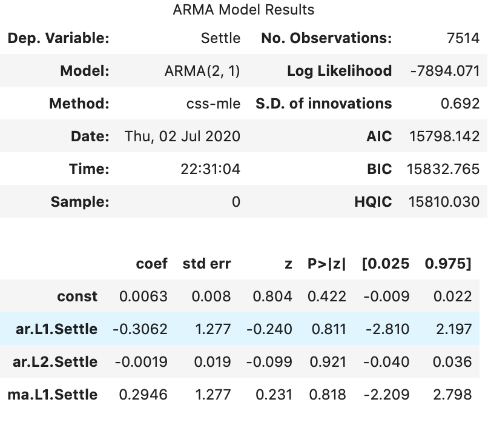
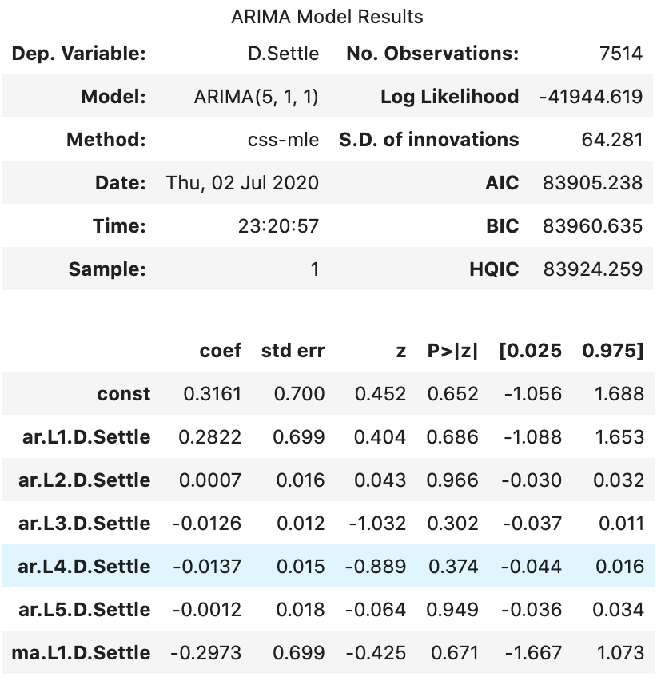
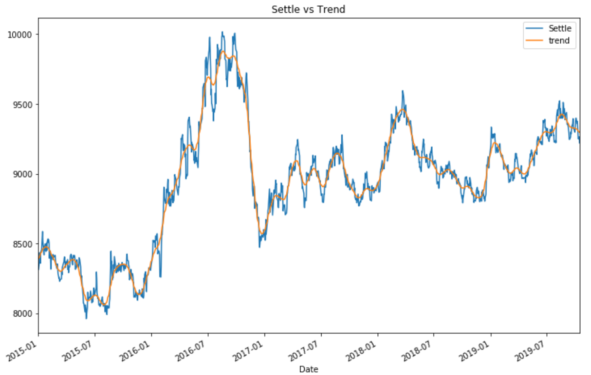
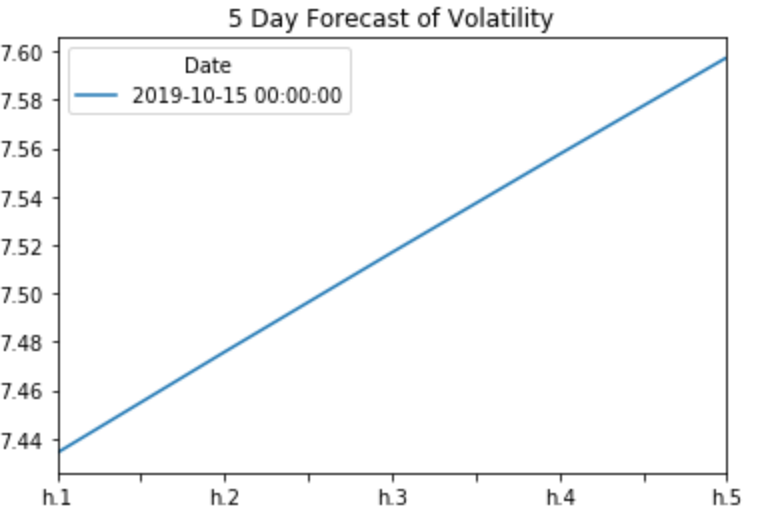

# Analysis for Unit 10—A Yen for the Future

## Time Series Analysis
Based on the time series results, neither the ARMA model nor the ARIMA model are good predictors of the Japanese Yen's value over the USD dollar. Both models resulted in p-values > 0.05.

ARMA Model

ARIMA Model

Also, there is alot of day-to-day volatility in the value of the Yen so if a company is required to make short term transactions, they will be at a higher risk of losing money.  The Hodrick-Prescott Filter shows that there may be slight opportunity to buy the Yen at a discount; however, there is higher risk of buying the Yen at a premium.  (When the Settle price is higher than the trend, the Yen is at a premium.  When the Settle price is lower than the trend the Yen is at a discount.)

The visual inspection of the volatility of the Yen is confirmed by assessing the volatility using the GARCH model.  The graph below shows the risk increasing over the next 5 days.

## Regression Analysis
A linear regression was ran on the yen data.  The Out-of-Sample Root Mean Square Error (RMSE) is smaller than the In-Sample RMSE, which indicates that the model performs better on the test data.  Given that the test data came from the same data sample as the training data, this would indicate that the test data has less anomalies than the training data.
