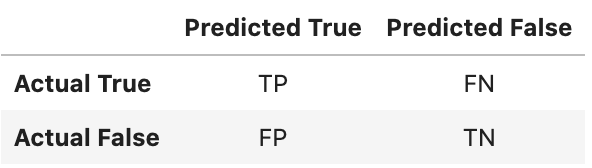

# Unit 11—Risky Business Analysis

## Resampling Analysis
The LoanStats_2019Q1.csv was analyzed in 4 ways:
1. Oversample using the Naive Random Oversampler algorithm
2. Oversample using the SMOTE algorithm
3. Undersample using the Cluster Centroids algorithm
4. Over- and Under-sample using the combination SMOTEENN algorithm

The results are as follows:
> |                               |   **Naive Random Oversampler**   |   **SMOTE**     |   **Cluster Centroids**   |   **Combination SMOTEENN**  |
> |   :------------------------   |   :-----------------:            |   :---------:   |   :-------------------:   |   :---------------------:   |
> |   Confusion Matrix [1]        |   51, 36                         |   51, 36        |   55, 32                  |   60, 27                    |
> |                               |   5249, 11869                    |   5871, 11247   |   10133, 6985             |   7150, 9968                |
> |   Balanced Accuracy Score     |   0.6398                         |   0.6216        |   0.5201                  |   0.6360                    |
> |   **Classification Report**                                                                                                                  |
> |   Precision High Risk         |   0.01                           |   0.01          |   0.01                    |   0.01                      |
> |   Precision Low Risk          |   1.00                           |   1.00          |   1.00                    |   1.00                      |
> |   Precision Avg Risk          |   0.99                           |   0.99          |   0.99                    |   0.99                      |
> |   Recall High Risk            |   0.59                           |   0.59          |   0.63                    |   0.69                      |
> |   Recall Low Risk             |   0.69                           |   0.66          |   0.41                    |   0.58                      |
> |   Recall Avg Risk             |   0.69                           |   0.66          |   0.41                    |   0.58                      |
> |   Geometric Mean High Risk    |   0.64                           |   0.62          |   0.51                    |   0.63                      |
> |   Geometric Mean Low Risk     |   0.64                           |   0.62          |   0.51                    |   0.63                      |
> |   Geometric Mean Avg Risk     |   0.64                           |   0.62          |   0.51                    |   0.63                      |

* **Accuracy**: The Naive Random Oversampler has the best accuracy score of 0.6398
* **Precision**: All 4 methods have the same precision of 0.99 average.  
* **Recall**: The Naive Random Oversampler has the best recall of 0.69 average.  
* **Geometric mean**: The Naive Random Oversampler also has the best geometric mean of 0.64 average.

## Ensemble Analysis
The LoanStats_2019Q1.csv was analyzed in 3 ways:
1. Train using the Balanced Random Forest Classifier
2. Train using the Easy Ensemble Classifier
3. Train using the AdaBoost Classifier

The results are as follows:
> |                               |   **Balanced Random Forest Classifier**   |   **Easy Ensemble Classifier**     |   **AdaBoost Classifier**   |
> |   :------------------------   |   :-----------------------------------:   |   :----------------------------:   |   :---------------------:   |
> |   Confusion Matrix [1]        |   57, 30                                  |   79, 8                            |   33, 54                    |
> |                               |   1368, 15750                             |   979, 16139                       |   6, 17112                  |
> |   Balanced Accuracy Score     |   0.7876                                  |   0.9254                           |   0.6895                    |
> |   **Classification Report**                                                                                                                  |
> |   Precision High Risk         |   0.04                                    |   0.07                             |   0.85                      |
> |   Precision Low Risk          |   1.00                                    |   1.00                             |   1.00                      |
> |   Precision Avg Risk          |   0.99                                    |   0.99                             |   1.00                      |
> |   Recall High Risk            |   0.66                                    |   0.91                             |   0.38                      |
> |   Recall Low Risk             |   0.92                                    |   0.94                             |   1.00                      |
> |   Recall Avg Risk             |   0.92                                    |   0.94                             |   1.00                      |
> |   Geometric Mean High Risk    |   0.78                                    |   0.93                             |   0.62                      |
> |   Geometric Mean Low Risk     |   0.78                                    |   0.93                             |   0.62                      |
> |   Geometric Mean Avg Risk     |   0.78                                    |   0.93                             |   0.62                      |

* **Accuracy**: The Easy Ensemble Classifier has the best accuracy score of 0.9254
* **Precision**: The AdaBoost Classifier has the best precision of 1.00 average.  
* **Recall**: The AdaBoost Classifier has the best recall of 1.00 average.  
* **Geometric mean**: The Easy Ensemble Classifier has the best geometric mean of 0.93 average.

The 3 methods perform significantly different in my opinion.  More analysis would need to be performed to understand which method is more appropriate for the task.

Using the Feature Importance method from Random Forests, total_rec_prncp, total_pymnt_in, and last_pymnt_amnt are the top 3 features.  See bar chart below.

Notes:
- [1] Please see matrix below to interpret the confusion matrix
