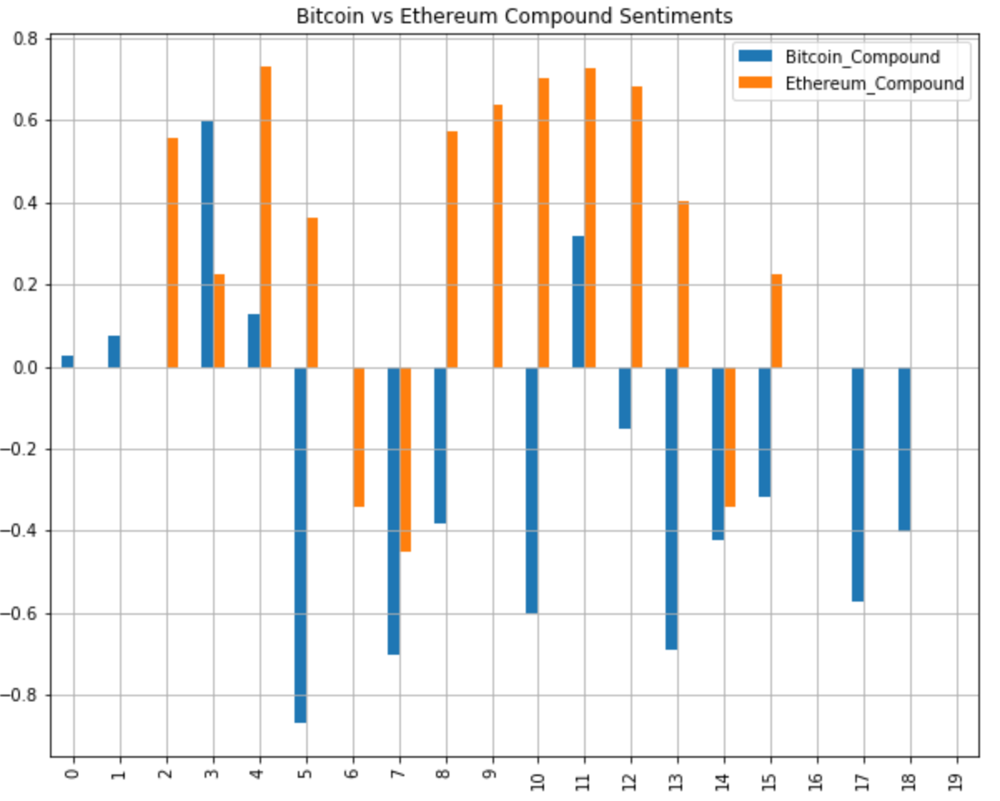

# Unit 12—Tales from the Crypto Analysis

## Sentiment Analysis
The newsapi was used to fetch the latest Bitcoin and Ethereum articles.  VADER's sentiment analysis was used to calculate the average compound, positive, negative, and neutral sentiment scores. See the figures below for the results.

**Bitcoin Sentiment Results**

**Ethereum Sentiment Results**

Overall, Ethereum had the highest compound and positive sentiment scores.  See the bar chart below for the compound sentiments per article.  It is easy to see that Ethereum has more positive scores than Bitcoin.

## Natural Language Processing
NLTK was used to clean up the articles. The clean up included:
- segregating the words
- setting all words to lowercase
- removing all punctuation
- removing stop words
- lemmatize words into root words

An N-grams analysis was performed to identify the most common two-word phrases in the articles. The word clouds below identify the most common words per analysis.

## Name Entity Recognition
Spacy was used to identify the entities within the articles.  The below pictures show examples of the results.

