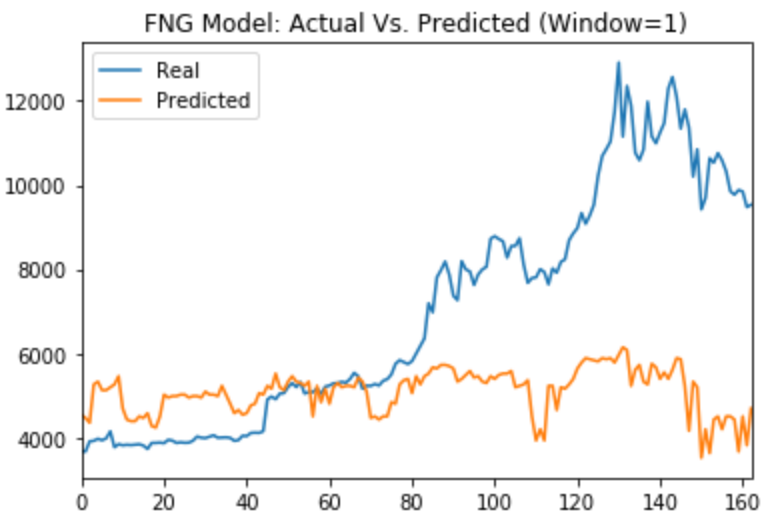
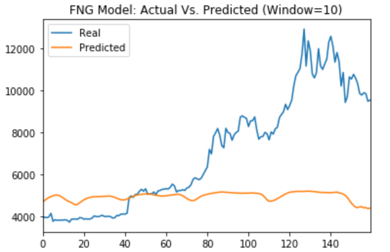
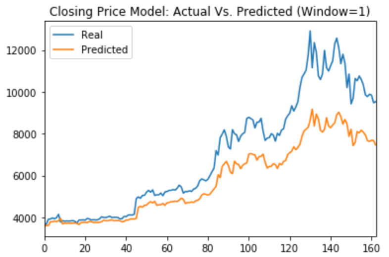
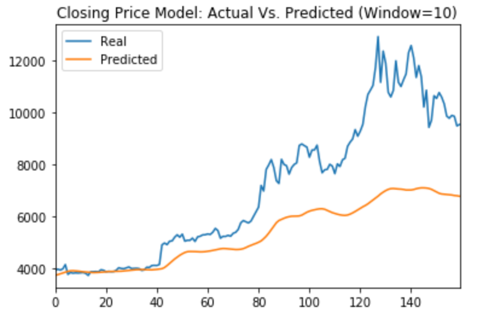

# LSTM Stock Predictor - Analysis

This project analyzed the [Crypto Fear and Greed (FNG) Index](https://alternative.me/crypto/fear-and-greed-index/) using the Long Short-Term Memory (LSTM) Recurrent Neural Networks (RNN) model from Keras to see if the FNG index was a good predictor of Bitcoin's price.  The same LSTM RNN model was used to analyze Bitcoin's closing prices to assess if the FNG index or Bitcoin's closing prices was better at determining future closing prices.

The analysis was performed using a window size of 1 and 10, in addition to the following parameters:
- Training/Testing Split: 70/30
- Number of units: 30
- Dropout Fraction: 0.2
- Epochs: 10

Analyzing the results, a window size of 1 resulted in the smallest loss for both models.  The Closing price model had the smallest loss overall.

|                 |   Window Size = 1   |   Window Size = 10   |
|   :---          |   :---:             |   :---:              |
|   FNG loss      |   0.1115            |   0.1227             |
|   Closing loss  |   0.0270            |   0.0581             |

Also, from plotting the actuals vs predicted closing prices, it appears that analyzing historical closing prices was a better predictor of future closing prices than using the FNG index.

**FNG Results**

**Closing Results**

