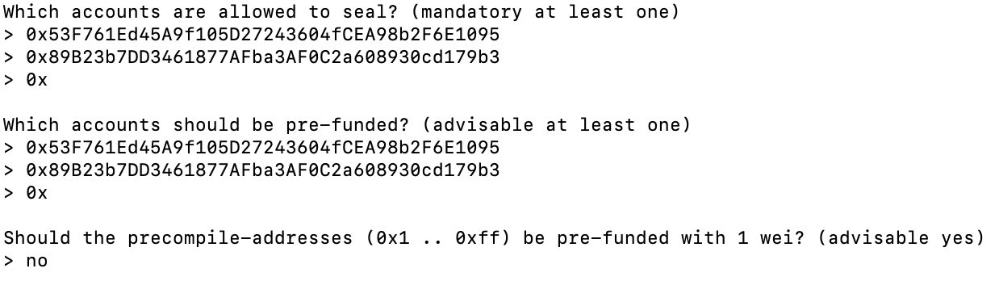
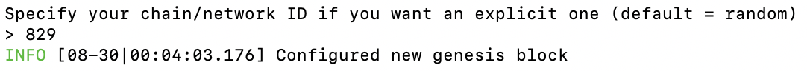
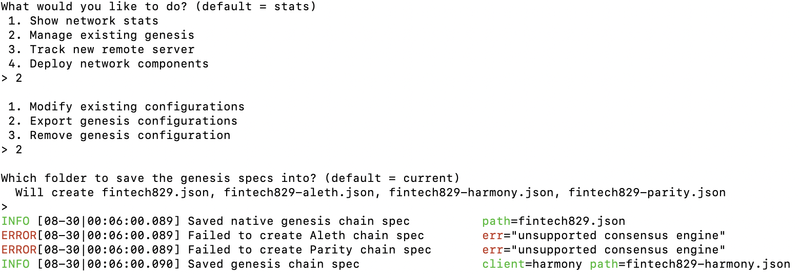

# How to Setup a Proof of Authority Block Chain (Mac Users)

## Assumptions
- User already has installed [MyCrypto](https://www.mycrypto.com/)
- User has installed the [Go Ethereum](https://geth.ethereum.org/downloads/) Tools
    - Save the "Geth & Tools 1.9.7"  to desired working location
    - Name working directory: Geth_Tools
- If you are reusing a blockchain directory, please remove old nodes.  Code example below assumes you have 2 nodes, node1 and node2 respectively
    > rm -Rf node1/geth node2/geth

## Create a New Wallet using a Mnemonic Phrase
- Open MyCrypto App
- Click 'Create New Wallet'

- Click 'Generate a Wallet' under Create New Wallet

- Click 'Generate a Mnemonice Phrase' under Mnemonic Phrase

- Save the 12 words, in order, in a safe location.  This will be your mnemonic phrase.  After saving the 12-word phrase, click 'Confirm Phrase'
- Now select the 12 words in the same order as shown on the previous screen to confirm your phrase. Click 'Confirm Phrase'
- Click 'Go to Account'
- Click on 'Change network' on the left hand side

- Click 'Kovan'

- click 'Mnemonic Phrase'
- enter your 12-word mnemonic phrase
- Click 'Choose address'

- Choose 'Testnet (ETH)' as the address
- Click any of the addresses that you want to unlock
- Click 'Unlock'
- Click 'copy address' underneath Account Address.  This is your public address.  Save this in the same location as your 12-word mnemonic phrase

Now that you have a wallet, let's fund it!
- Go to https://faucet.kovan.network/ and login with your GitHub Account
- Copy your Kovan public Address
- Click 'Send me KETH'

KETH should be on it's way!  Let's go back to your wallet to check!
- Click the refresh icon under Account Balance.  You should now have 1 ETH.

## Setup a custom blockchain
- Open Terminal, Terminal 1, and navigate to the Geth_Tools working directory
- If you have already cre

- Run puppeth
./puppeth
-- If you receive the below error click 'Cancel.'

-- Go to System Preferences -> Security & Privacy -> General and then click 'Allow Anyway' next to the puppeth warning

-- Go back to Terminal 1 and re-run puppeth
./puppeth
-- Click 'Open'

- Specify network name
-- fintech828

- Configure new genesis block using Proof of Authority
-- 2 Configure new genesis
-- 1 Create new genesis from scratch
-- 2 Clique - proof-of-authority
-- enter (default 15 seconds)

- Define the accounts to seal and pre-fund
-- Paste the public address of the first account to seal and press enter
-- Paste the public address of the second account to seal and press enter
-- Paste the public address of the first account to pre-fund and press enter
-- Paste the public address of the second account to pre-fund and press enter
-- Do not pre-fund with 1 wei

- Specify chain ID
-- 828

Congratulations! You completed the creation of your genesis block.

- Export genesis block
-- 2 Manage existing genesis
-- 2 Export genesis configuration
-- enter (current folder)

Now that your genesis block is exported, it is ready to be used.  Type control C to exit from puppeth.

## Set up nodes
- In your Geth_Tools directory set up node1
-- ./geth account new --datadir node1
---- If you get a geth error, click 'Cancel'

---- Go to System Preferences -> Security & Privacy -> General and then click 'Allow Anyway' next to the geth warning

---- Go back to Terminal 1 and re-run puppeth
./geth account new --datadir node1
---- Click 'Open'

-- Define a password for node1
-- Confirm password
-- Store your password, public key and private key in a safe location

- Set up node2
-- ./geth account new --datadir node2
-- Define a password for node2
-- Confirm password
-- Store your password, public key and private key in a safe location

- Initialize both nodes
-- Initialize node1
./geth init fintech827.json --datadir node1
-- Initialize node2
./geth init fintech827.json --datadir node2
