# How to Setup a Proof of Authority Blockchain (Mac Users)

## Assumptions
- User already has installed [MyCrypto](https://www.mycrypto.com/)
- User has installed the [Go Ethereum](https://geth.ethereum.org/downloads/) Tools
    - Save the "Geth & Tools 1.9.7"  to desired working location
    - Name working directory: Geth_Tools
- If you are reusing a blockchain directory, please remove old nodes.  Code example below assumes you have 2 nodes, node1 and node2 respectively
    > rm -Rf node1/geth node2/geth

## Create a New Wallet using a Mnemonic Phrase
- Open the MyCrypto App
- Click 'Create New Wallet' on the left hand side
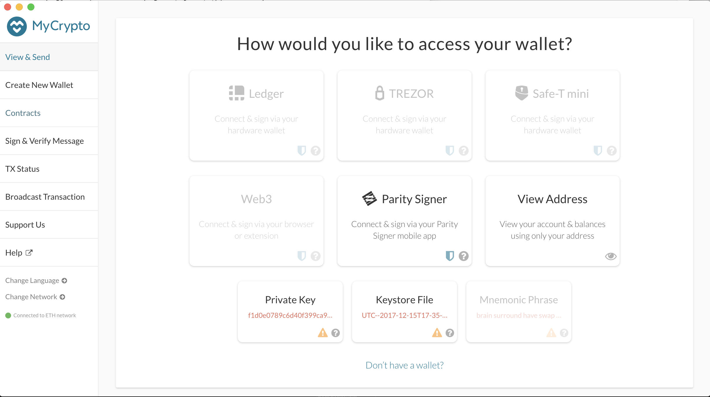
- Click 'Generate a Wallet' under Create New Wallet
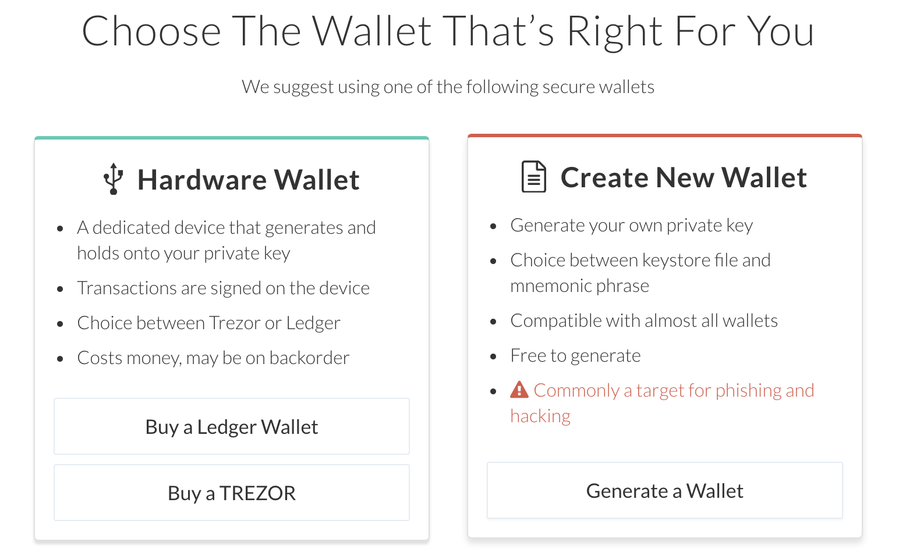
- Click 'Generate a Mnemonic Phrase' under Mnemonic Phrase

- Save the 12 words, in order, in a safe location.  This will be your mnemonic phrase.  After saving the 12-word phrase, click 'Confirm Phrase'
- Now select the 12 words in the same order as shown on the previous screen to confirm your phrase. Click 'Confirm Phrase'
- Click 'Go to Account'
- Click on 'Change network' on the left hand side

- Click 'Kovan'
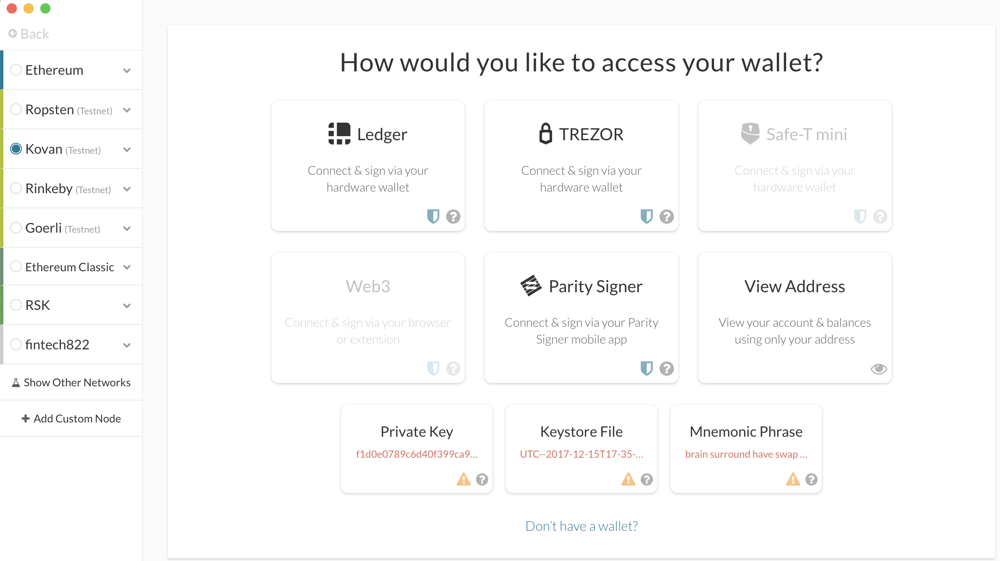
- Click 'Mnemonic Phrase'
- Enter your 12-word mnemonic phrase
- Click 'Choose address'

- Choose 'Testnet (ETH)' as the address
- Click any of the addresses that you want to unlock
- Click 'Unlock'
- Click 'copy address' underneath Account Address.  This is your public address.  Save this in the same location as your 12-word mnemonic phrase
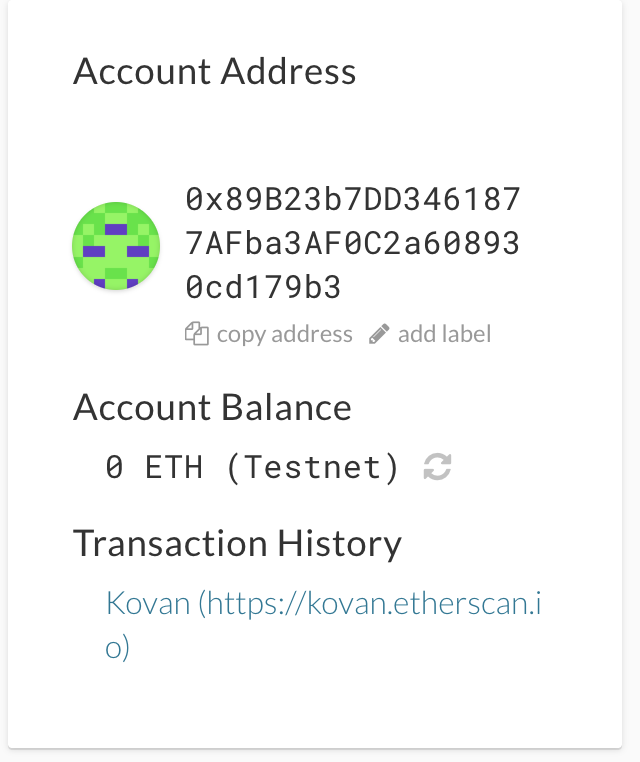

Now that you have a wallet, let's fund it!
- Go to https://faucet.kovan.network/ and login with your GitHub Account
- Copy your Kovan public Address
- Click 'Send me KETH'

KETH should be on it's way!  Let's go back to your wallet to check!
- Click the refresh icon under Account Balance.  You should now have 1 ETH.

- Click on 'Wallet Info' on the top to get access to your private key.
- Click on the 'eye' icon to view your private key and store with your public address and 12-word phrase

Repeat the steps above to create a second wallet for the blockchain.

## Setup a Custom Blockchain
- Open a new Terminal, Terminal 1, and navigate to the Geth_Tools working directory
- Run puppeth
    > ./puppeth

    - If you receive the below error click 'Cancel.'
    
    - Go to System Preferences -> Security & Privacy -> General and then click 'Allow Anyway' next to the puppeth warning
    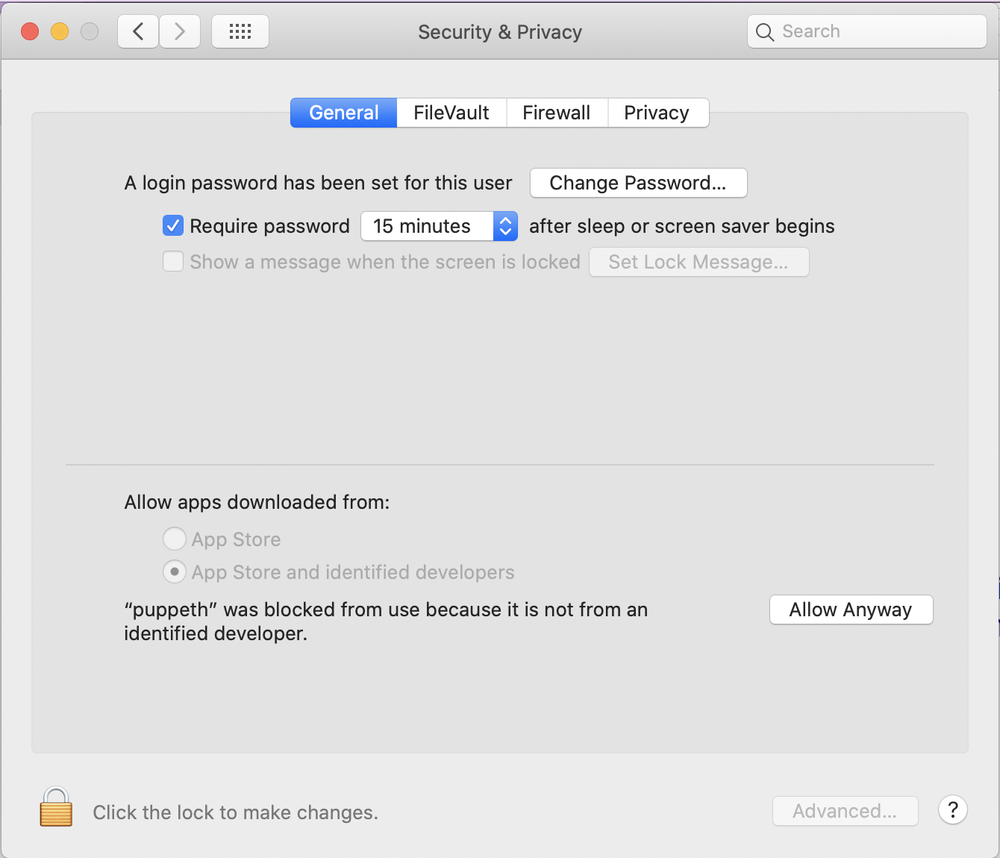
    - Go back to Terminal 1 and re-run puppeth
    > ./puppeth
    - Click 'Open'
    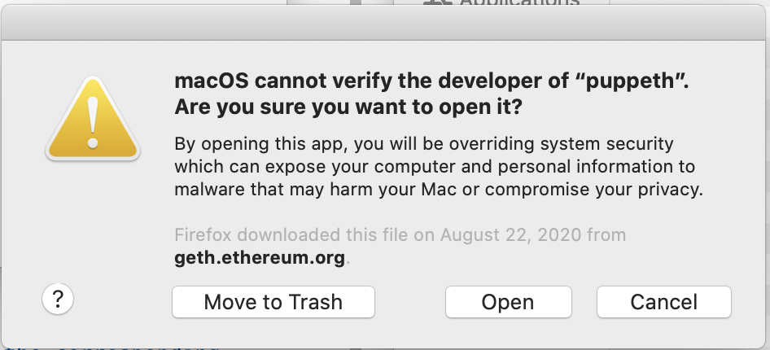

- Specify your network name
    > fintech829

    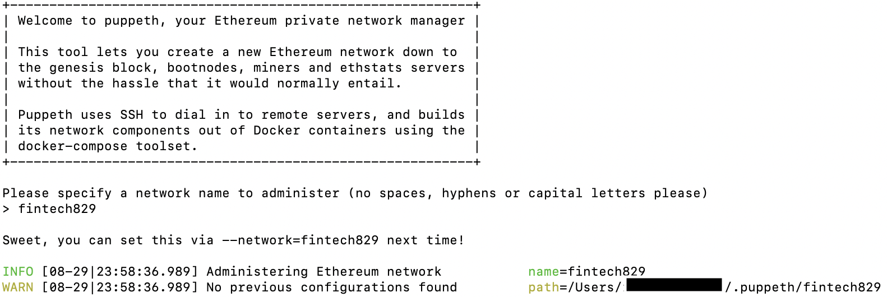

- Configure your new genesis block using Proof of Authority
    - 2 Configure new genesis
    - 1 Create new genesis from scratch
    - 2 Clique - proof-of-authority
    - enter (default 15 seconds)
    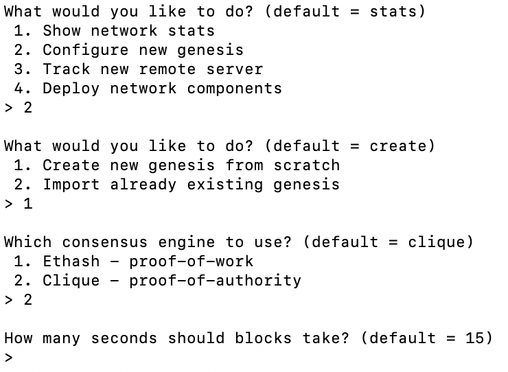

- Define the accounts to seal and pre-fund
    - Paste the public address of the first account to seal and press enter
    - Paste the public address of the second account to seal and press enter
    - Paste the public address of the first account to pre-fund and press enter
    - Paste the public address of the second account to pre-fund and press enter
    - Do not pre-fund with 1 wei
    

- Specify the chain ID
    > 829
    
    

Congratulations! You completed the creation of your genesis block.

- Export your genesis block for use
    - 2 Manage existing genesis
    - 2 Export genesis configuration
    - enter (current folder)
    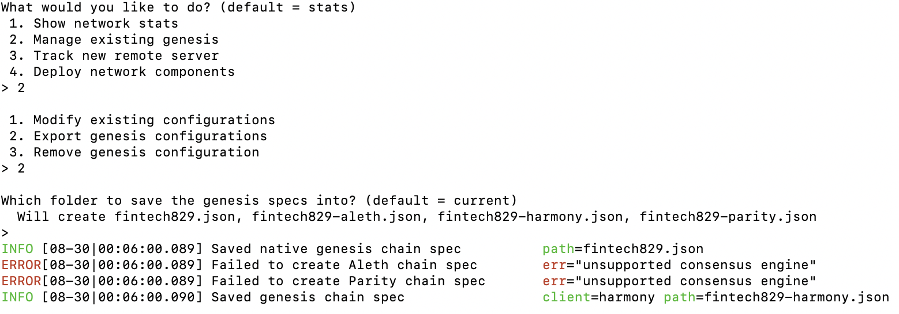

Now that your genesis block is exported, it is ready to be used.  Type control C to exit from puppeth.

## Setup Nodes
- In your Geth_Tools directory set up node1
    > ./geth account new --datadir node1
    - If you get a geth error, click 'Cancel'
    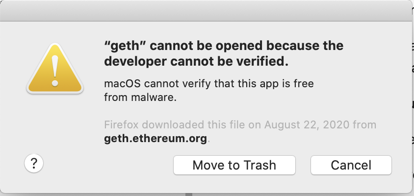
    - Go to System Preferences -> Security & Privacy -> General and then click 'Allow Anyway' next to the geth warning
    
    - Go back to Terminal 1 and re-run puppeth
    > ./geth account new --datadir node1
    - Click 'Open'
    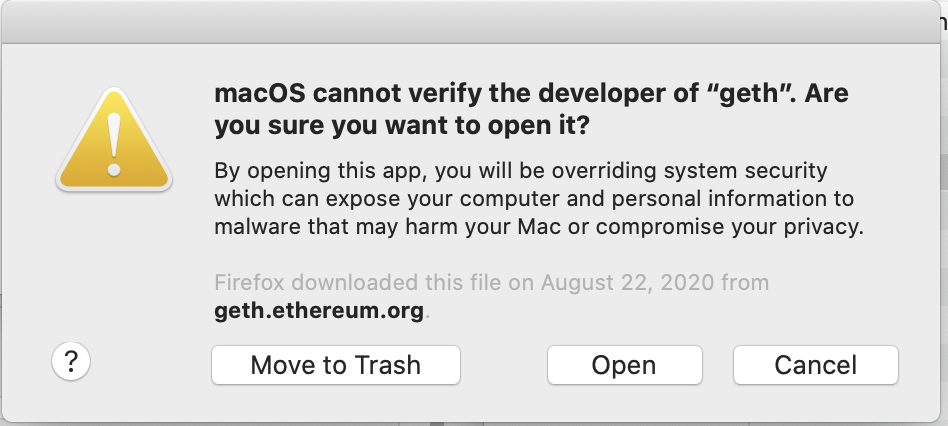
- Define a password for node1
- Confirm password
- Store your password, public key and private key in a safe location

- Set up node2
    > ./geth account new --datadir node2
- Define a password for node2
- Confirm password
- Store your password, public key and private key in a safe location

- Initialize both nodes
    - Initialize node1
    > ./geth init fintech829.json --datadir node1
    - Initialize node2
    > ./geth init fintech829.json --datadir node2

- Start mining
    > ./geth --datadir node1 --mine --minerthreads 1
    - Save the enode from the scrolling text.
    

- Open a second Terminal, Terminal 2, and navigate to the same Geth_Tools directory
- Start mining the second node using the enode from Terminal 1
    > ./geth --datadir node2 --port 30304 --rpc --bootnodes "enode://9adc086c41b67815636355f9d8289e816dbe3cf6dcd38a115045d56f0549c0d05a3abe489df535692ede9b292c694cfb69f413751e57b4534708e77eb49fa4c0@127.0.0.1:30303"

## Send Test Transaction
Could not complete this step as the mining for the Proof of Authority did not work.