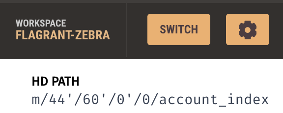

# Profit Sharing Contract

## Smart Contract Options
This smart contract allows companies to distribute Ether to employees via 3 Options:
1. **Equal Split**
Company can distribute any amount of Ether evenly between 3 employees. If the amount of Ether to split does not divide evenly between 3 employees, the remainder will remain in the companies account.

2. **Tiered Split**
Company can distribute any amount of Ether as a percentage per employee, up to 3 employees.  The percentage is fixed as follows: Employee #1: 60%, Employee #2: 25%, Employee #3: 15%

3. **Deferred Equity**
Company can choose to distribute 250 shares per year up to 4 years (total 1000 shares) to one employee.  If the employee quits before the 4 years, only the vested shares will remain in the employees account.  The shares will vest at the end of the employee's yearly anniversary.

## Setup
In order to use the smart contract, the company will need to be on the LocalHost 8545 network in metamask.

In order to receive profit sharing payments, the employees will need to have an Ethereum account.
 

 ## Profit Sharing
1. **Equal Split**
The company will need to provide the following inputs:
- Value: amount of ether to split equally between 3 employees
- Employee 1 Address: address of Ethereum account which will receive 1/3 of the Ether value
- Employee 2 Address: address of Ethereum account which will receive 1/3 of the Ether value
- Employee 3 Address: address of Ethereum account which will receive 1/3 of the Ether value

2. **Tiered Split**
The company will need to provide the following inputs:
- Value: amount of ether to split as a percentage between 3 employees
- Employee 1 Address: address of Ethereum account which will receive 60% of the Ether value
- Employee 2 Address: address of Ethereum account which will receive 25% of the Ether value
- Employee 3 Address: address of Ethereum account which will receive 15% of the Ether value

3. **Deferred Equity**
The company will need to provide the following input:
- Employee Address: address of Ethereum account which is eligible to receive up to 1,000 shares vested evenly over the course of 4 years
