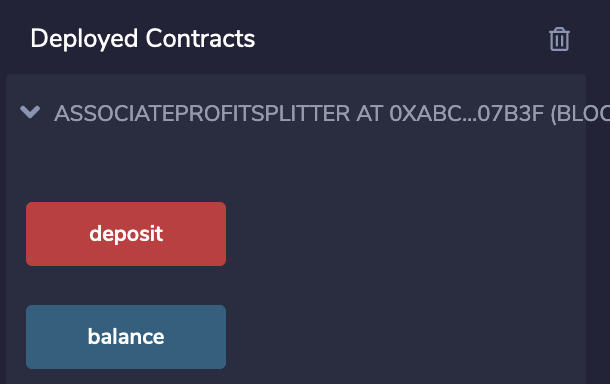
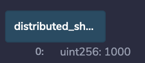

# Profit Sharing Contract

## Smart Contract Options
This smart contract allows companies to distribute Ether to employees via 3 Options:
1. **Equal Split**
Company can distribute any amount of Ether evenly between 3 employees. If the amount of Ether to split does not divide evenly between 3 employees, the remainder will remain in the companies account.

2. **Tiered Split**
Company can distribute any amount of Ether as a percentage per employee, up to 3 employees.  The percentage is fixed as follows: Employee #1: 60%, Employee #2: 25%, Employee #3: 15%

3. **Deferred Equity**
Company can choose to distribute 250 shares per year up to 4 years (total 1000 shares) to one employee.  If the employee quits before the 4 years, only the vested shares will remain in the employees account.  The shares will vest at the end of the employee's yearly anniversary.

## Setup
In order to use the smart contract, the company will need to be on the LocalHost 8545 network in metamask.

In order to receive profit sharing payments, the employees will need to have an Ethereum account.
 

 ## Profit Sharing
1. **Equal Split**
The company will need to provide the following inputs:
- Value: amount of ether to split equally between 3 employees
- Employee 1 Address: address of Ethereum account which will receive 1/3 of the Ether value
- Employee 2 Address: address of Ethereum account which will receive 1/3 of the Ether value
- Employee 3 Address: address of Ethereum account which will receive 1/3 of the Ether value

2. **Tiered Split**
The company will need to provide the following inputs:
- Value: amount of ether to split as a percentage between 3 employees
- Employee 1 Address: address of Ethereum account which will receive 60% of the Ether value
- Employee 2 Address: address of Ethereum account which will receive 25% of the Ether value
- Employee 3 Address: address of Ethereum account which will receive 15% of the Ether value

3. **Deferred Equity**
The company will need to provide the following input:
- Employee Address: address of Ethereum account which is eligible to receive up to 1,000 shares vested evenly over the course of 4 years

## Example using Solidity
The below examples show how each option would work by exercising the smart contract on the Solidity platform.
1. **Equal Split**
- Step 1: Identify which address will represent the company account.

- Step 2: Identify which 3 accounts will receive funds.

- Step 3: Compile code

- Step 4: Deploy code

In order to deploy the code, the addresses for the 3 employees need to be provided.  The environment needs to be set to 'Injected Web3.' The account needs to be set to the address that will represent the company account.  The value should be set to 0. Click 'transact.'

- Step 5: Click confirm on MetaMask

- Step 6: Enter amount of ether to distribute (10 ETH)

- Step 7: Click deposit

- Step 8: Click confirm on MetaMask

- Step 9: Confirm company account reduce by 10 ETH

- Step 10: Confirm employee accounts increased by equal amounts (3.33 ETH)

2. **Tiered Split**
- Step 1: Identify which address will represent the company account.  Use same as in previous example.

- Step 2: Identify which 3 accounts will receive funds. Use same as in previous example

- Step 3: Compile code

- Step 4: Deploy code

In order to deploy the code, the addresses for the 3 employees need to be provided.  The environment needs to be set to 'Injected Web3.' The account needs to be set to the address that will represent the company account.  The value should be set to 0. Click 'transact.'

- Step 5: Click confirm on MetaMask

- Step 6: Enter amount of ether to distribute (10 ETH)

- Step 7: Click deposit

- Step 8: Click confirm on MetaMask

- Step 9: Confirm company account reduce by 10 ETH

- Step 10: Confirm the following account increases: 60% Employee 1, 25% Employee 2, and 15% Employee 3

3. **Deferred Equity** 
- Step 1: Identify which address will represent the company account.  Use same as in previous example.

- Step 2: Identify which account will receive the 1,000 shares. Use Employee 1 from the previous example

- Step 3: Compile code

- Step 4: Deploy code

In order to deploy the code, the addresses for Employee 1 needs to be provided.  The environment needs to be set to 'Injected Web3.' The account needs to be set to the address that will represent the company account.  The value should be set to 0. Click 'transact.'

- Step 5: Click 'distributed_shares' to confirm the beginning token balance is 0.

- Step 6: Click on 'fastforward' 4 times, each representing 100 days. Click confirm on the metamask per fastforward.  This will accelerate the time to test the code.

- Step 7: Click on 'distribute' to initiate a payment. Click 'Confirm' on MetaMask.

- Step 8: Click 'distributed_shares' to confirm the token balance increased to 250.

- Step 9: Repeat Step 5-8 to confirm the balance increases by 250 tokens per year and caps at 1,000 tokens

