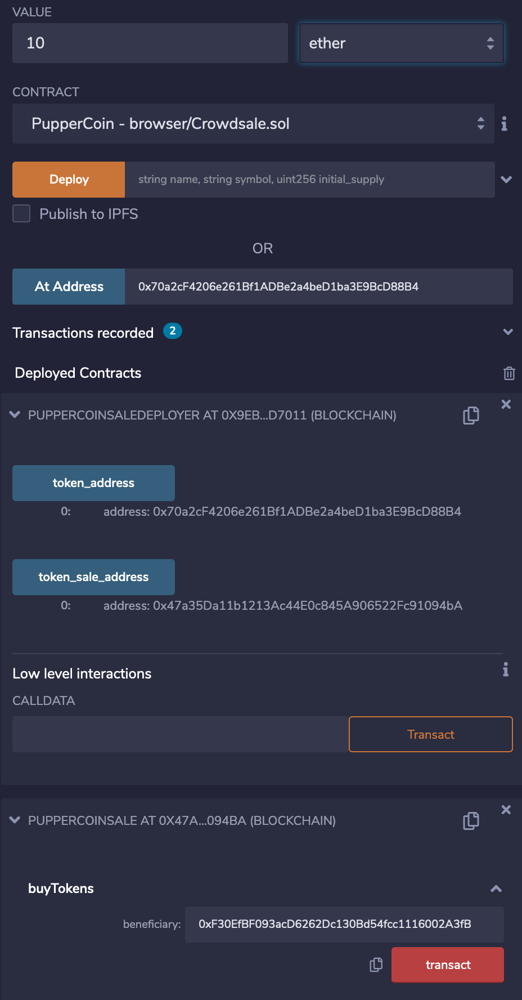

# PupperCoin Crowdsale

This contract will allow users to use ETH to buy PUP (PupperCoin) tokens. The purpose of the contract is to track dog breeding activities.  The contract will run for 24 weeks.

The following steps are done to deploy and test the contract.
1) Compile PupperCoin.sol
- Contains contract PupperCoin

2) Compile Crowdsale2.sol
- Contains contract PupperCoinSale and PupperCoinSaleDeployer

3) Deploy PupperCoinSaleDeployer
- Select PupperCoinSaleDeployer under Contract
- Provide a name
- Provide a symbol
- Provide the address of the wallet to deploy from
- Provide a goal amount
- Click transact

4) Set the PupperCoinSale address
- Select PupperCoinSale under contract
- Under the PupperCoinSaleDeployer contract click token_sale_address
- Copy the address under token_sale_address
- Paste token_sale_address in the field next to At Address
- click At Address

5) Set the PupperCoin address
- Select PupperCoin under contract
- Under the PupperCoinSaleDeployer contract click token_address
- Copy the address under token_address
- Paste token_address in the field next to At Address
- Click At Address

6) Buy tokens
- Put 10 ether under Value
- Under the PupperCoinSale contract put the address of the account you want to use to buy tokens under buyTokens
- Click transact

Kept getting a Gas estimation failed error when trying to buy tokens so I was not able to verify the transaction.